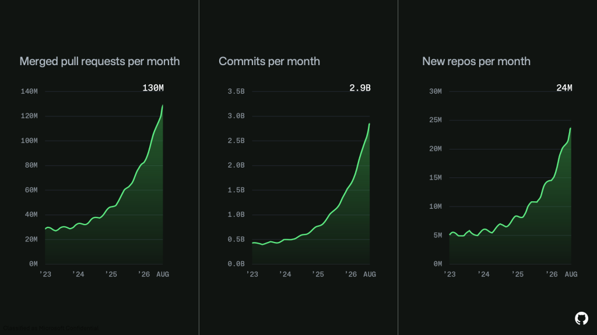
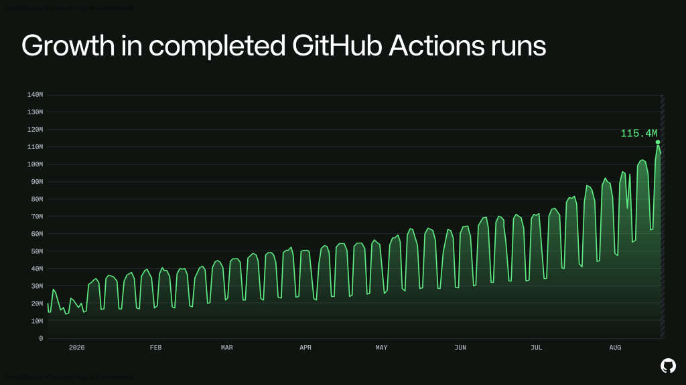
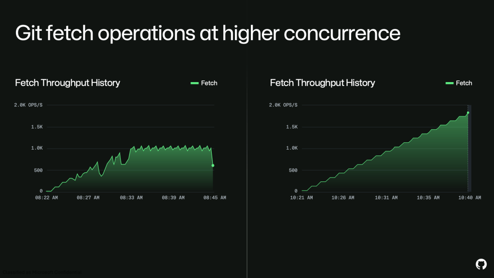

# Do we still need GitHub?

GitHub was down for seven hours and forty-seven minutes on 17 August. I was not blocked. The agents kept running, the code was on my laptop, the tests passed. The only thing I could not do was push.

That is worth examining. In a codebase mostly written by agents, what is git a system of record for?

## The numbers

[GitHub's write-up](https://github.blog/news-insights/company-news/the-august-17-outage-and-the-work-ahead/) is a growth report with an outage attached.

Commits per month went from 1.4 billion in April 2026 to 2.9 billion in August. Merged pull requests reached 130 million a month, new repositories 24 million.

Actions runs reached 115.4 million. The sawtooth is weekends; agents still mostly run when a human starts them.

GitHub's remediation is three million additional CPU cores and 120 petabytes of storage. Neither recent incident involved a bad deploy or a bad config. Both were capacity failures.

## What breaks for humans

Agents commit at machine cadence — forty commits in an afternoon where a feature used to take a week of deliberate ones.

I do not read commit history anymore. `git blame` returns a message an agent wrote to satisfy a convention, describing a change made for reasons it no longer holds in context.

`git bisect` is worse off. It assumes each commit builds independently and that the property under test flips exactly once across the range. Agent commits are checkpoints in a loop, so half do not compile on their own. Bisect is effectively unusable on my repositories now.

## What breaks for storage

Git is a content-addressed object store, and packfiles keep it tractable by delta-compressing similar objects against one another. That assumes successive versions of a file are similar, which is what human editing produces.

Agents rewrite whole files, rename concepts across directories, and restructure modules because restructuring is cheaper than editing. Those are poor deltas, so packs grow closer to linear in commit count than in actual change.

One detail from the same report: Copilot's outage was prolonged by a client-side retry loop that increased traffic during recovery. An agent amplified the outage while it was happening. A human who gets a 500 stops. A retry loop does not, across every developer's fleet at once.

## What git records

Git records code — what it looks like now, what it looked like before, who changed it, how to get back. That was worth the engineering effort when code was expensive.

If I can regenerate a module from a prompt in ninety seconds, the code is not the valuable artifact. The path to it is: the PRD, the prompt that worked and the four that did not, the harness run that found the bug, what the agent tried and abandoned, the constraint someone typed at 2am that shaped everything after it.

None of that is in git. This is what [PRD-driven development](prd-driven-development.html) was reaching for, and it did not go far enough.

## What it cannot merge

Three developers, one goal, three agent runs, three different codebases — different abstractions, different file layouts, different names for the same concept. The nondeterminism moved from the line level to the architecture level.

Git merges text. A three-way merge assumes a common ancestor and small divergence from it, and agent runs violate both. When two runs disagree about whether something is a class or a closure, there is no merge algorithm, only a decision. GitHub presents the output as the thing to reconcile, but the conflict happened upstream, in three prompts nobody wrote down.

## What still needs git

Git is not going anywhere. CI triggers on it, deploys pin to it, rollback is a revert, and provenance and signed releases assume a commit SHA is immutable. That is load-bearing infrastructure regardless of who wrote the diff.

But it has changed jobs. It is no longer how we understand a codebase. It is content-addressed storage with a very good distribution model.

The missing layer sits above it: prompts, PRDs, harness runs, agent memory — versioned, diffable, and shared across a team the way code is. Nobody has built it well yet. Meanwhile the reasoning that produced ten thousand lines this week is in a scrollback buffer I will close tomorrow, and we are adding 120 petabytes to store the output instead.
